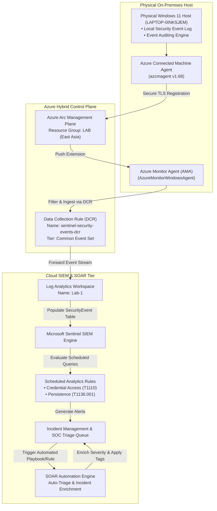
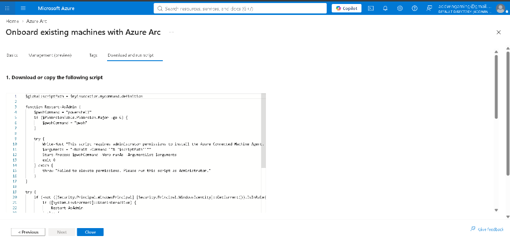
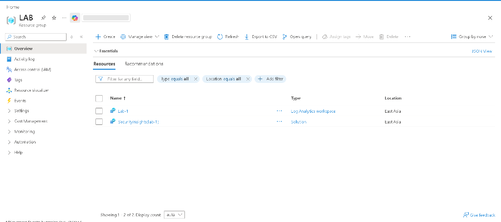
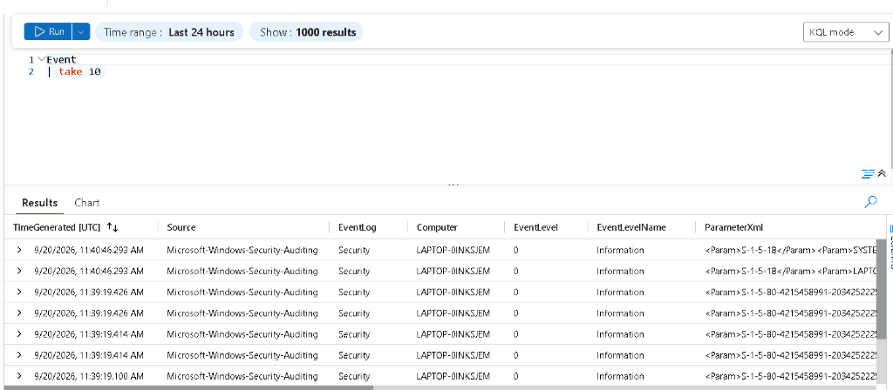
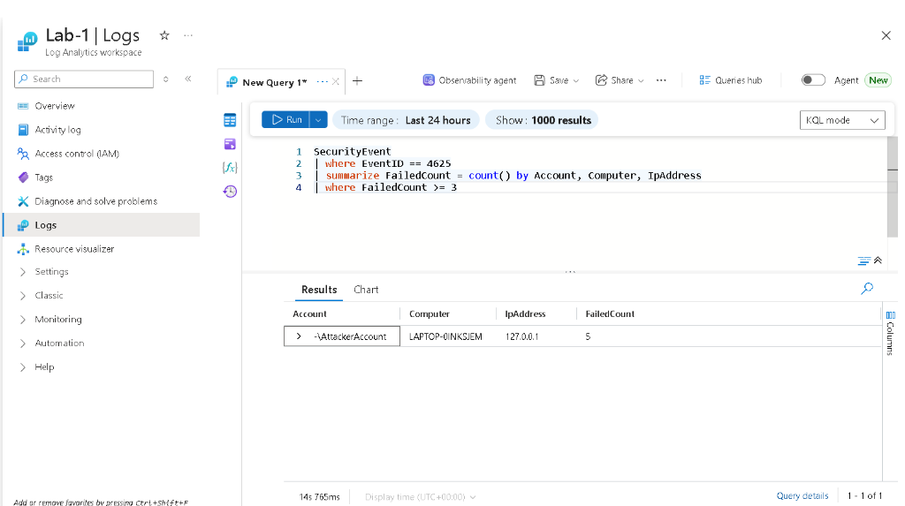
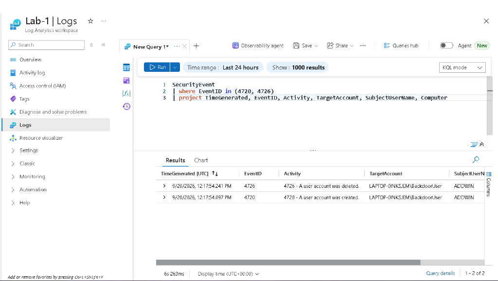
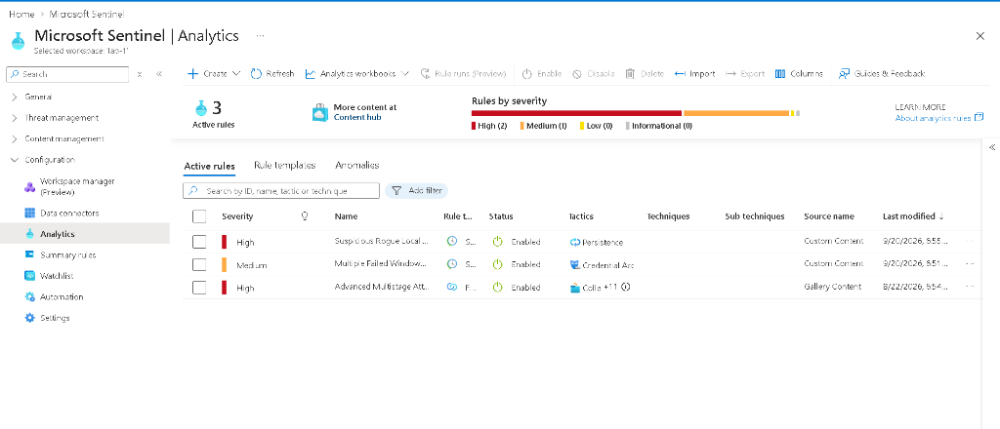
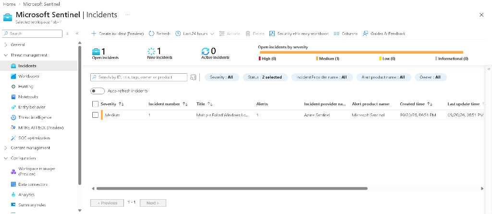
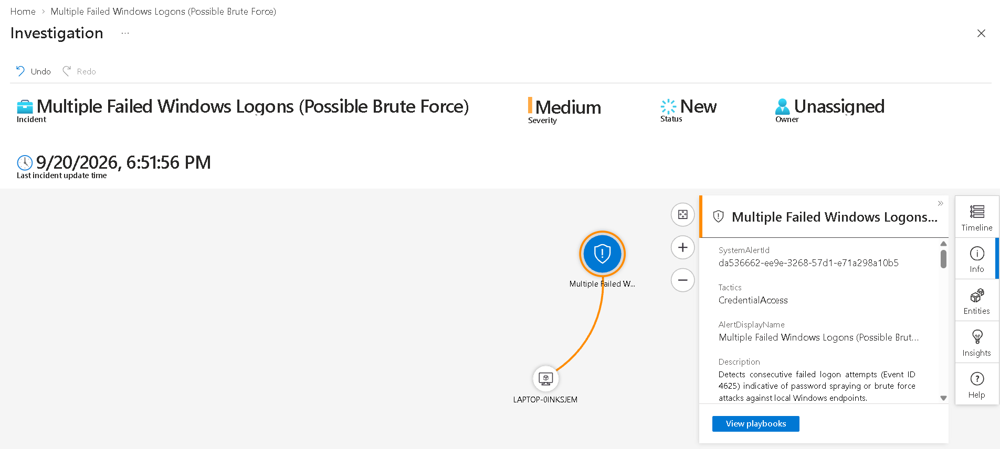
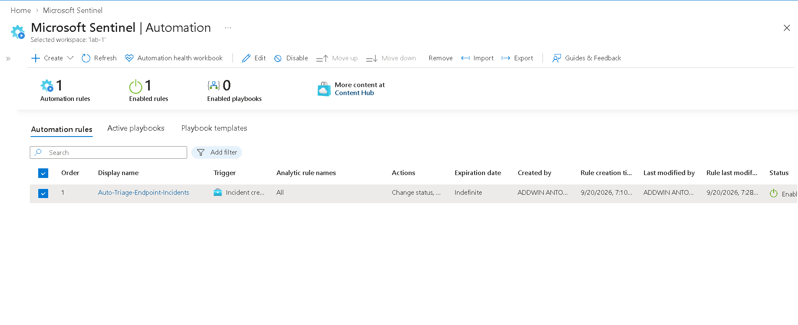

# Enterprise Cloud SIEM & Hybrid SOC Threat Investigation Lab


## 📌 Executive Summary

This repository contains the end-to-end architecture, telemetry pipeline engineering, multi-stage adversary simulation, KQL detection rules, and **SOAR automated incident triage** for an **Enterprise Hybrid Cloud SOC Lab** using **Microsoft Sentinel**, **Azure Arc**, **Azure Monitor Agent (AMA)**, and a **physical Windows 11 host (`LAPTOP-0INKSJEM`)**.

By leveraging **Azure Arc**, the on-premises physical endpoint was projected directly into the Azure Resource Manager (ARM) control plane as a hybrid compute asset. This enabled zero-cost enterprise telemetry ingestion, multi-stage cyber threat hunting, scheduled analytics alert generation, and automated SOAR incident response without incurring costly cloud VM compute bills.

---

## 🏗️ Architecture & Telemetry Pipeline



---

## ⚔️ Multi-Stage Adversary Simulation & MITRE ATT&CK Mapping

Unlike basic labs that evaluate only a single logon failure, this environment models an **adversary kill chain** from initial access to persistence:

| Kill Chain Stage | Simulated Action | Event ID | MITRE ATT&CK | Sentinel Detection |
| :--- | :--- | :--- | :--- | :--- |
| **1. Credential Access** | Automated password spray / brute force against local user accounts | `4625` | **Brute Force (T1110)** | `Multiple Failed Windows Logons` |
| **2. Privilege Escalation** | Elevation to administrative security token context | `4672` | **Valid Accounts (T1078)** | Admin Privilege Assignment Hunt |
| **3. Persistence** | Unauthorized creation of rogue backdoor account (`BackdoorUser`) | `4720` | **Local Account (T1136.001)** | `Suspicious Rogue Local Account Creation` |
| **4. Defense Evasion** | Rapid deletion of backdoor account to cover tracks | `4726` | **Indicator Removal (T1070)** | Account Lifecycle Audit Query |

---

## ⏱️ Step-by-Step Implementation Chronology

### Phase 1: Cloud Foundation & Subscription Configuration
1. **Azure Environment**: Configured Azure for Students subscription.
2. **Resource Group**: Provisioned resource group `LAB` in region `East Asia`.
3. **Log Analytics Workspace**: Deployed `Lab-1` as the central security data lake.
4. **Microsoft Sentinel**: Activated Sentinel solution on top of `Lab-1`.

### Phase 2: Hybrid Endpoint Onboarding via Azure Arc
* **Challenge**: Azure for Students policies enforce region restrictions on compute resources. When initial deployment attempted `centralindia`, Azure policy returned `RequestDisallowedByAzure (403)`.
* **Resolution**: Identified workspace locality in `East Asia` and connected the agent directly using:
  ```powershell
  & "$env:ProgramW6432\AzureConnectedMachineAgent\azcmagent.exe" connect `
      --resource-group "LAB" `
      --tenant-id "<TENANT_ID>" `
      --location "eastasia" `
      --subscription-id "<SUB_ID>" `
      --cloud "AzureCloud" `
      --enable-automatic-upgrade
  ```
* **Status**: Computer `LAPTOP-0INKSJEM` achieved **Connected** state under `Microsoft.HybridCompute/machines`.

### Phase 3: Telemetry Pipeline & Data Collection Rule (DCR)
1. Created Data Collection Rule `sentinel-security-events-dcr` in `LAB`.
2. Target: `LAPTOP-0INKSJEM`.
3. Event stream: Windows Security Events (`Common` set).
4. Azure Arc pushed the **Azure Monitor Agent (`AzureMonitorWindowsAgent`)** to the physical endpoint automatically.

### Phase 4: Attack Simulation & Telemetry Verification
Executed multi-stage attacks via elevated PowerShell:
```powershell
# 1. Password Spray / Brute Force (5x Event ID 4625)
1..5 | ForEach-Object { net use \\127.0.0.1\c$ /user:AttackerAccount WrongPass!$_ 2>$null }

# 2. Rogue Backdoor Account Creation (Event ID 4720) & Deletion (Event ID 4726)
net user BackdoorUser P@ssw0rd2026! /add
net user BackdoorUser /delete
```

### Phase 5: Detection Engineering & Scheduled Analytics Rules
Configured two custom detection rules in Sentinel:
1. **Multiple Failed Windows Logons (Possible Brute Force)**
   - Severity: Medium | Tactics: Credential Access (T1110)
   - Evaluates `SecurityEvent` every 5 minutes for $\ge 3$ failed logon attempts.
2. **Suspicious Rogue Local Account Creation (Persistence)**
   - Severity: High | Tactics: Persistence (T1136.001)
   - Evaluates `SecurityEvent` for Event ID 4720 with entity mapping for Host and Account.

### Phase 6: SOAR Automated Incident Triage
Configured automated response rule **`Auto-Triage-Endpoint-Incidents`**:
- **Trigger**: When incident is created
- **Actions**:
  - Automatically tags incidents with `Hybrid-Lab`, `Windows-Endpoint`, `Triage-Required`
  - Sets incident lifecycle state to **Active**

---

## 🖼️ Proof of Execution (Forensic Evidence)

### 1. Azure Arc Hybrid Endpoint Registration

*Figure 1: Generation of Azure Arc Connected Machine Agent onboarding script for physical Windows 11 endpoint.*

### 2. Cloud Infrastructure Architecture in Resource Group `LAB`

*Figure 2: Resource group `LAB` in East Asia hosting Log Analytics workspace `Lab-1` and Sentinel SIEM solution.*

### 3. Live Telemetry Stream Ingested in Azure

*Figure 3: Windows Security Auditing stream actively ingested from `LAPTOP-0INKSJEM`.*

### 4. Detection 1: Brute Force Password Spray (Event ID 4625)

*Figure 4: Real-time KQL aggregation catching 5 failed authentication attempts against `AttackerAccount` from `127.0.0.1`.*

### 5. Detection 2: Rogue Backdoor Account Persistence (Event IDs 4720 & 4726)

*Figure 5: KQL forensic timeline identifying unauthorized user account `BackdoorUser` creation and rapid deletion.*

### 6. Active Sentinel Analytics Detection Rules Dashboard

*Figure 6: Microsoft Sentinel Analytics engine actively enforcing Custom Scheduled Query Rules across MITRE ATT&CK tactics.*

### 7. Live Sentinel Incident Generated

*Figure 7: Microsoft Sentinel Incident Queue showing active Incident #1 triggered by brute force logon detection from endpoint LAPTOP-0INKSJEM.*

### 8. SOC Investigation Graph (Interactive Entity Mapping)

*Figure 8: Microsoft Sentinel visual investigation graph mapping host LAPTOP-0INKSJEM, attack entities, and correlated timeline.*

### 9. SOAR Automated Triage Rule

*Figure 9: Microsoft Sentinel Automation rule configured to auto-tag incoming incidents, assign severity, and advance lifecycle state.*

---

## 🔎 Production KQL Queries

### Scenario 1: Failed Logon Aggregation (MITRE T1110)
```kql
SecurityEvent
| where EventID == 4625
| summarize 
    FailedCount = count(),
    StartTime = min(TimeGenerated),
    EndTime = max(TimeGenerated)
    by Account, Computer, IpAddress
| where FailedCount >= 3
```

### Scenario 2: Rogue Backdoor Account Creation (MITRE T1136.001)
```kql
SecurityEvent
| where EventID in (4720, 4726)
| project 
    TimeGenerated,
    EventID,
    Activity,
    TargetAccount,
    SubjectUserName,
    SubjectDomainName,
    Computer
| order by TimeGenerated desc
```

### Scenario 3: Privilege Escalation Auditing (MITRE T1078)
```kql
SecurityEvent
| where EventID == 4672
| project TimeGenerated, Account, Computer, PrivilegeList
| order by TimeGenerated desc
```

---

## 📂 Repository Structure

```text
microsoft-sentinel/
├── README.md                           # Master Architecture, Pipeline & Incident Report
├── docs/                               # Engineering Documentation & Media Assets
│   ├── 01-hybrid-soc-lab-guide.md      # Detailed Step-by-Step Deployment Guide
│   └── media/                          # Forensic Evidence & Execution Screenshots
│       ├── 01-azure-arc-script.png
│       ├── 02-resource-group-lab.png
│       ├── 03-live-event-stream.png
│       ├── 04-kql-brute-force-4625.png
│       ├── 05-kql-backdoor-account-4720.png
│       └── 06-analytics-rules-active.png
└── kql-queries/                        # Production KQL Detection & Threat Hunting Scripts
    ├── 01-failed-logons-brute-force.kql
    ├── 02-rogue-backdoor-account.kql
    ├── 03-admin-privilege-assignment.kql
    ├── 04-explicit-credential-logons.kql
    └── 05-heartbeat-and-agent-health.kql
```
